# SonarCloud Setup

SonarCloud is SaaS for Code Quality check (Supports all major development environments!)

1.  Visit https://sonarcloud.io and SignUp using your GitHub Account.

2.  Using SonarCloud dashboard, create a new Organization (Collection of Projects)
    Note down "Organization Key" for later use.

    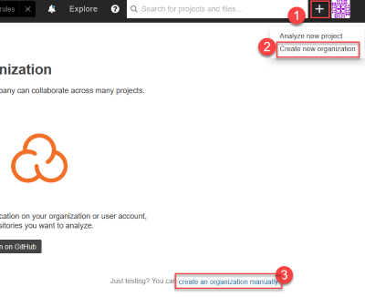
    
    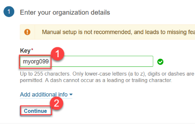
    
    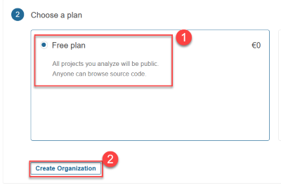

3.  Create a new Project under the newly created Organization. 
    Note down "Project Key" for later use.

    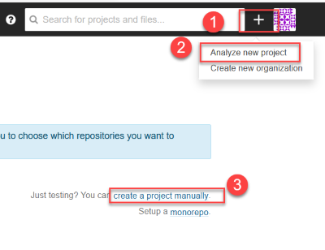

    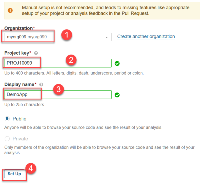

4.  Using My Account > Security > Generate Token , Create and Copy new access token for later use.

    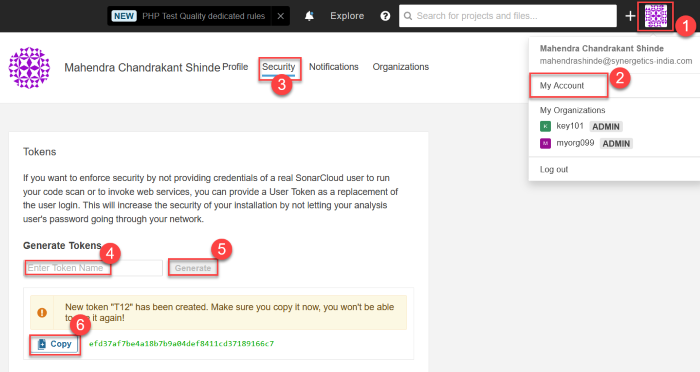

5.  Download `SonarQube Scanner CLI` from this URL: [Windows](https://binaries.sonarsource.com/Distribution/sonar-scanner-cli/sonar-scanner-cli-4.4.0.2170-windows.zip) or [Linux](https://binaries.sonarsource.com/Distribution/sonar-scanner-cli/sonar-scanner-cli-4.4.0.2170-linux.zip) 

    Also extract the contents of downloaded ZIP at your "D:" drive.

6.  Download and Install SonarQube Scanner Plugin in Jenkins

    Visit http://localhost:8080/pluginManager/available , Search for `Sonar` and Select and Install `SonarQube Scanner for jenkins` (Use Install without restart)

    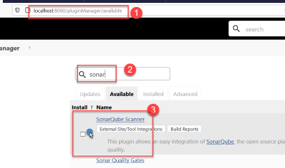

7.  Goto Manage Jenkins > Manage Credentials > Jenkins > Global credentials (Unrestricted)

    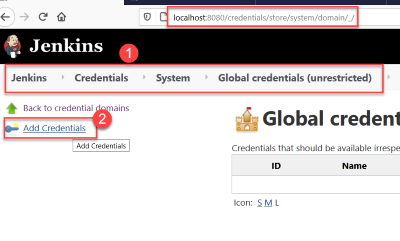
    Click on `Add Credentials` then enter following details:

    ```yml
    Kind:   Secret text
    Scope:  Global
    Secret: [Use token from step#4]
    ID: SA_TOKEN
    Description:  Sonar Cloud Access Token
    ```

    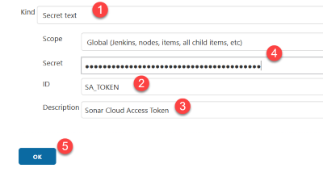

    click `OK` button

8.  Goto Manage Jenkins > Configure System > SonarQube Installations

    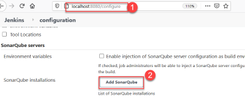

    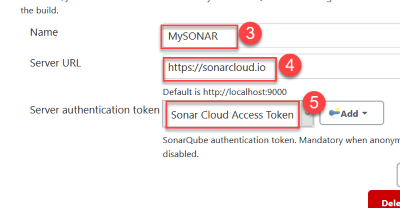
    
    Provide following values:
    
    ```yml
    Name:       MySONAR
    ServerURL:  https://sonarcloud.io
    Server Authentication Token: Sonar Cloud Access Token
    ```

    Click `Save` button.

9.  Goto Manage Jenkins > Global Tool Configuration 

    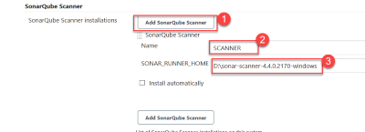
    
    Click `Add SonarQube Scanner` provide these details:

    ```yml
    Name: SCANNER
    SONAR_RUNNER_HOME: D:\sonar-scanner-4.4.0.2170-windows
    ```

    > DO NOT USE `INSTALL AUTOMATICALLY`

    Click `Save` button

10. Modify jenkins job "Job2" and we will add one more `Build Step`
    
    - Remove any `Abort Build when stuck`
    - Add new `Build Step` > Execute SonarQube Scanner with following details 
        [After Top Level Maven Target step]:

    ```
    JAVA: JDK8
    sonar.organization=[From Step#2]
    sonar.projectKey=[From Step#3]
    sonar.sources=src
    sonar.java.binaries=target
    ```

    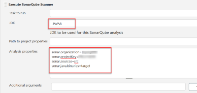
    
    Click `Save` Button, and then `Build Now` to Manually trigger a build.

11. Wait for approx 3/5 minutes and then when build is successful, sonarcloud project link your  project dashboard.

    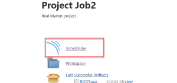


